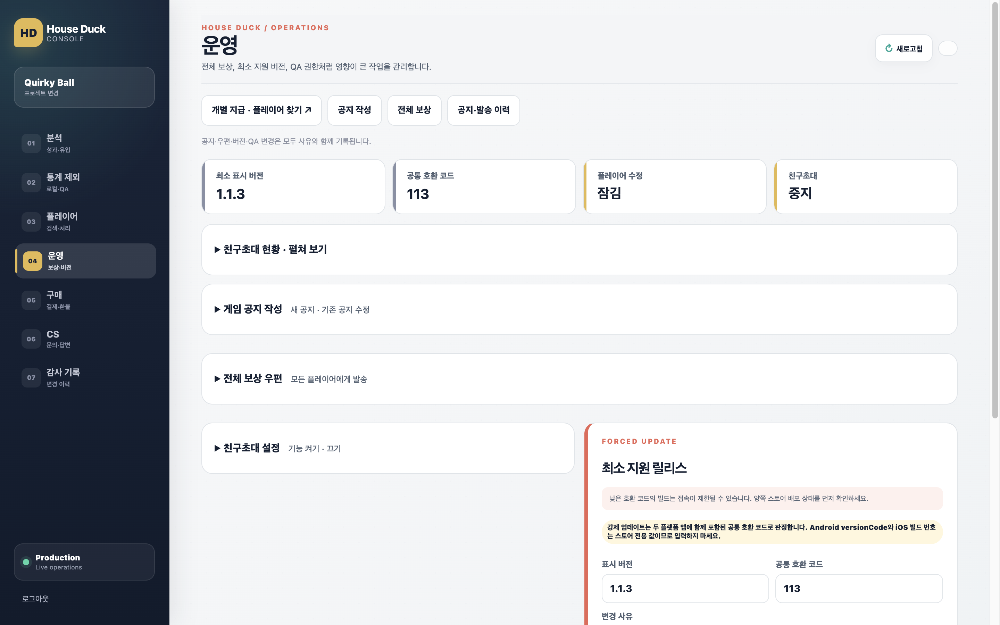
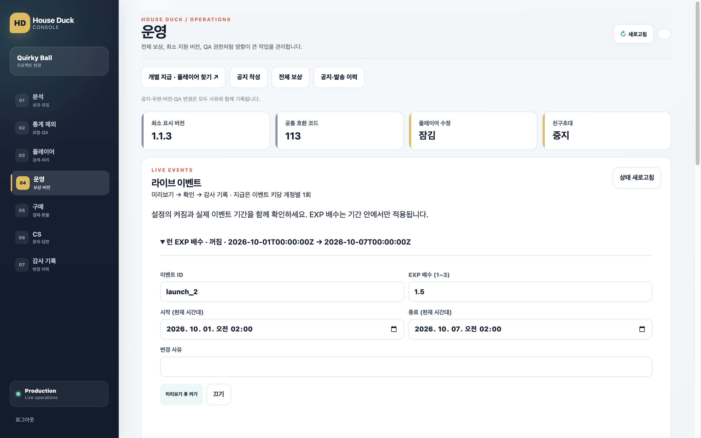
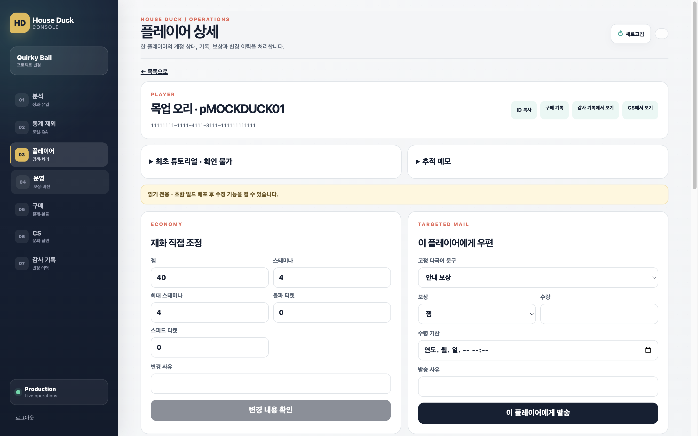
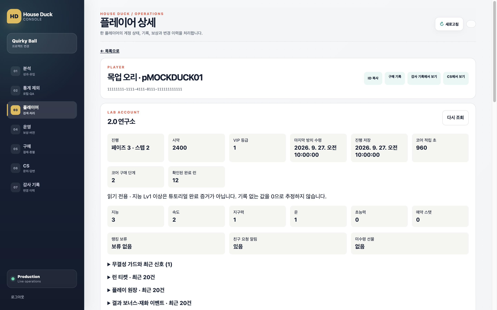
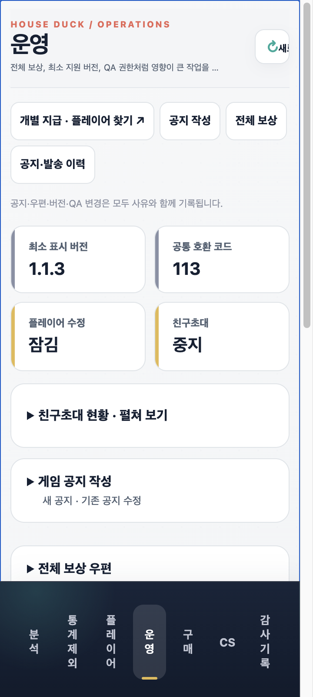
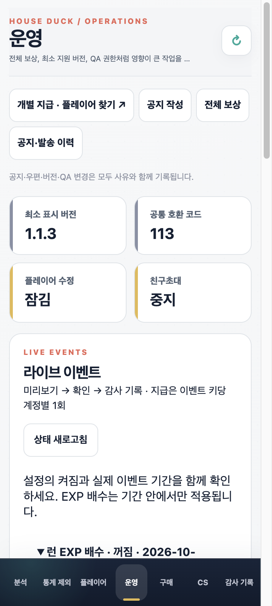

# 콘솔 2.0 화면 증거

Aside 로컬 목업, 한국어, 데스크톱 1440×900 / 모바일 iframe 360×800, 동일 합성 계정·데이터다. PNG는 Retina 2배 해상도다. 실제 고객 데이터·실제 결제·Android/iPhone 결과가 아니다.
비포는 시작 커밋 `d9829e6`, 애프터는 최종 구현에서 조회 완료 후 새로 캡처했다.

| 화면 | 수정 전 | 수정 후 |
|---|---|---|
| 운영 |  |  |
| 플레이어 |  |  |
| 운영 360px |  |  |

추가 화면: [랭킹](after-ranking.png), [분석](after-analytics.png), [신고](after-reports.png), [연구소 360px](after-player-360.png), [구매 360px](after-purchases-360.png).

확인한 입력: 이벤트 미리보기→확인, 취소 시 쓰기 0회, 구매 Sandbox 필터, 개인 조회 실패→재조회, 랭킹 UUID 비교, 분석 49/50 표본 경계, 게임 내 신고 열기. 저장은 목업 호출만 기록한다.
모바일 운영·연구소·구매·분석·랭킹·신고에서 문서 가로 넘침이 없음을 확인했다. 목업의 Production 표시는 기존 콘솔 장식이며 실제 운영 서버 연결을 뜻하지 않는다.

재현: `node scripts/console_2x_fixture.cjs` 실행 후 `http://127.0.0.1:8765/console/`, 360px은 `/_qa/360`이다. 비포를 재현하려면 `git archive d9829e6 console | tar -x -C .tmp/console-before`로 기준 파일을 준비한다(해당 임시 디렉터리를 먼저 만든다).
